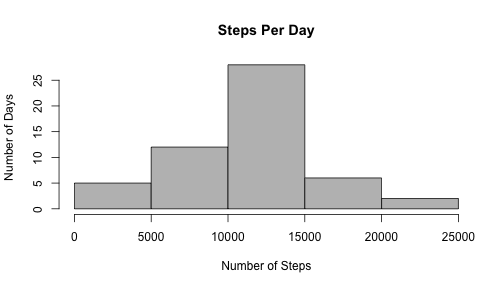
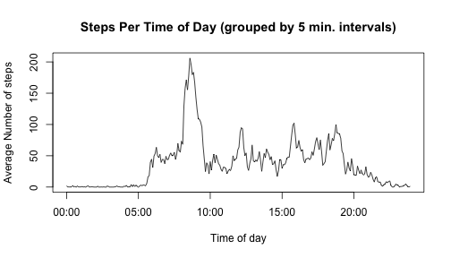
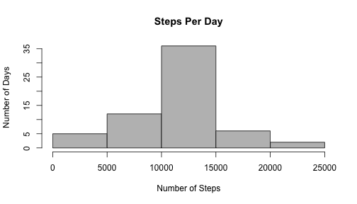
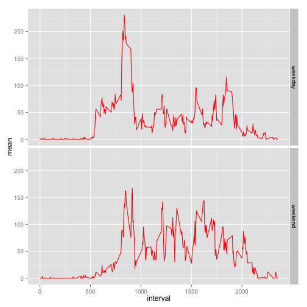

Set some options (probably already the defaults, but just in case).

```r
library(knitr)
opts_chunk$set(echo=TRUE, results="asis")
```
  

### Load activity data, show frequency of steps per day, compute mean and median steps taken per day

```r
library(plyr)
rawStepData <- read.csv("activity.csv")
stepsPerDay <- ddply(rawStepData, .(date), summarize, steps=sum(steps))
meanStepsPerDay <- format(mean(stepsPerDay$steps, na.rm = TRUE), scientific=FALSE)
medianStepsPerDay <- median(stepsPerDay$steps, na.rm = TRUE)
hist(stepsPerDay$steps, main="Steps Per Day", col="gray", ylab="Number of Days", xlab="Number of Steps")
```

 
  
Mean steps taken per day (missing values removed from data set): 10766.19  
Median steps taken per day(missing values removed from data set): 10765  
 
   
### Find Average Daily Activity Pattern
      
Find mean number of steps per time of day 
(grouped by 5 minute intervals)


```r
meanStepsPerInterval <- ddply(rawStepData, .(interval), summarize, steps=mean(steps, na.rm=TRUE))
meanStepsPerInterval <- mutate(meanStepsPerInterval, intervalAsDateTime = strptime(gettextf("%04d", interval), 
                        format ="%H%M"))
plot(meanStepsPerInterval$intervalAsDateTime, meanStepsPerInterval$steps,  
     type="l", main = "Steps Per Time of Day (grouped by 5 min. intervals)", 
     ylab = "Average Number of steps", xlab = "Time of day")
```

 
  
  Find the 5 minute interval with the greatest average number of steps  

```r
meanStepsPerInterval <- mutate(meanStepsPerInterval, intervalAsTime = strftime(intervalAsDateTime, 
                               format ="%H:%M:%S"))
intervalWithMaxSteps <- which.max(meanStepsPerInterval[,2])
timeWithMaxSteps <- meanStepsPerInterval[intervalWithMaxSteps, "intervalAsTime"]
```
  
The time of day with the greatest average number of steps is 08:35:00.
  
### Impute Missing Values
  
Find the total number of rows with missing data.

```r
missingData <- sum(is.na(rawStepData$steps))
```
The number of rows with missing data is 2304
  
Here we create a new data set with the missing values replaced with the mean of the values from the corresponding
time interval across all days.

```r
imputedStepData <- rawStepData
for(i in 1:nrow(imputedStepData)){ 
      if(is.na(imputedStepData[i,1])){ #If the interval is missing data
            #Find the corrsponding interval in the meanStepsPerInterval data frame, and plug it in.
              interval <- imputedStepData[i, 3]
              indexOfMean <- match(interval, meanStepsPerInterval$interval)
              imputedStepData[i,1] <- meanStepsPerInterval[indexOfMean, 2]
      }
}
```
Now plot the newly created histogram

```r
iStepsPerDay <- ddply(imputedStepData, .(date), summarize, steps=sum(steps))
iMeanStepsPerDay <- format(mean(iStepsPerDay$steps, na.rm = TRUE), scientific=FALSE)
iMedianStepsPerDay <- format(median(iStepsPerDay$steps, na.rm = TRUE ), scientific=FALSE)
hist(iStepsPerDay$steps, main="Steps Per Day", col="gray", ylab="Number of Days", xlab="Number of Steps")
```

 
  
Mean steps taken per day with imputed data: 10766.19  
Median steps taken per day with imputed data: 10766.19   
  
Inserting means for the missing values addressed the issue of missing data, and had no apprecialble
effect on the overall behavior of the data. The only noticable change to the casual observer is that   
the median was driven to the mean. This was due to the fact that in the earlier analysis, 
the missing values were disregarded in the computation of mean and median steps per day.
  
### Differentiate Between Weekdays and Weekends
  
Add a factor variable, weekday, with levels "weekday" and "weekend".

```r
library(lubridate)
imputedStepData <- mutate(imputedStepData, dayOfWeek = weekdays(ymd(date), abbreviate=TRUE))
imputedStepData <- mutate(imputedStepData, weekday = 
                           as.factor(ifelse(dayOfWeek %in% 
                           c("Mon", "Tue", "Wed", "Thu", "Fri"), "weekday", "weekend")))
```
  
 Use the weekday factor and the interval to find means for each time of day accross Mon/Tue/Wed/Thu/Fri versus Sat/Sun
   

```r
weekdayMeans <- ddply(imputedStepData, .(weekday, interval), summarize, mean=round(mean(steps), 1))
library(ggplot2)
g <- ggplot(data = weekdayMeans, aes(x = interval, y = mean)) + geom_line(color = "red") + 
            facet_grid(weekday ~.)
print(g)
```

 
  
As one would expect, there is greater concentration of steps around the beginning and end of the business day duriing the week, and more actvivity spread out through the entire day on the weekend.
